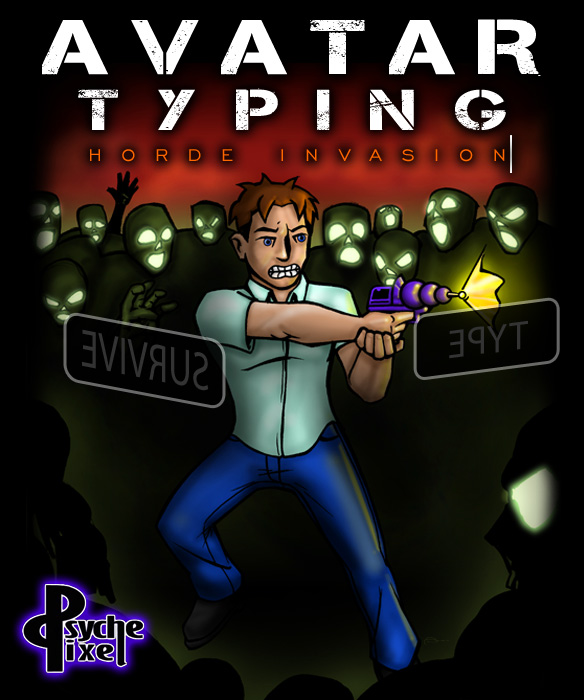
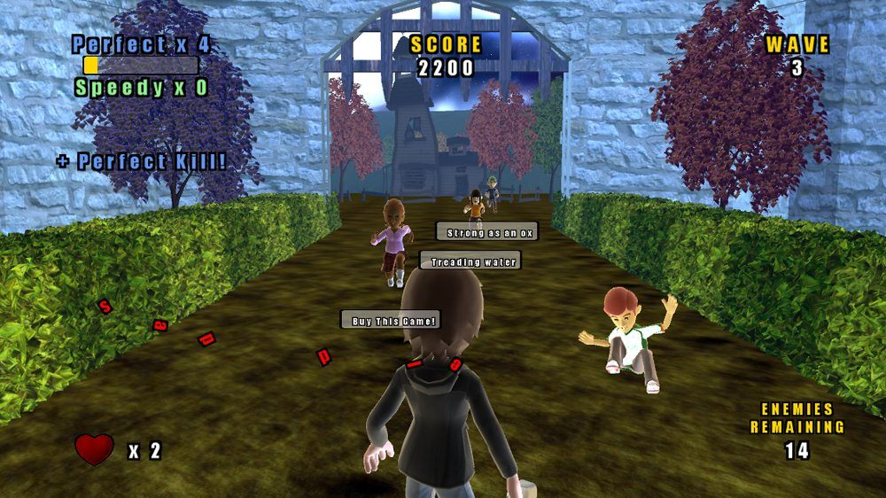
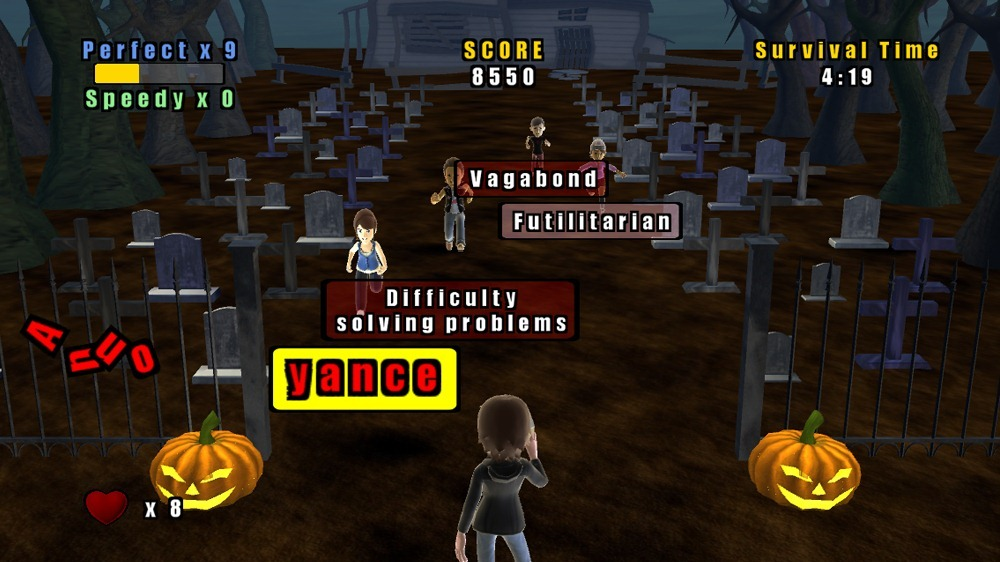
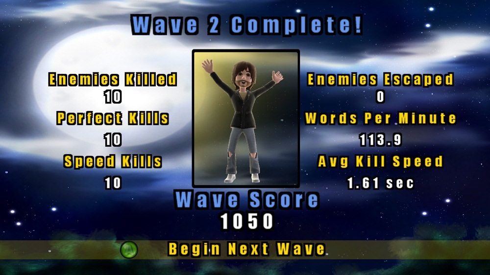

# Avatar Typing: Hoard Invasion

## Overview

This is a relatively simple game released on the Xbox Live Indie Games marketplace, released in 2011.

My primary goal with this project was to learn the XNA Framework and basic principles of game development and design, as well as further my C# knowledge. For better or worse, I was not too focused on sales or the Xbox Live userbase; I certainly was not expecting a console typing game to capture a huge audience! However, the game reviewed well and sales surpassed those of the average XBL Indie game.

In order to complete the project, thousands of lines of code were written. A lot of this code went into the Engine itself, which was built with the help of the XNA Framework, which provides a layer of abstraction for things such as rendering, player input, physics, and more. I also had to do some of the asset creation myself, as well as modify most assets I purchased / licensed.

## Game Description (as presented on Xbox Live)

Stop an onslaught of angry Avatars by…typing? Logical enough! Can you type the sentences you're given before the enemies cross your path? Featuring 8 enemy types and 2 modes of play, the action is sure to last. With over 1,500+ sentences to type and the ability to create your own, you're almost guaranteed to develop a fun case of carpal tunnel!

**Chatpad or Keyboard required.**

## Try the Game?

Unfortunately, Xbox Live Indie Games closed down in October of 2017. I do not believe there is an official means to play this -- or any other -- XBL Indie game.

## Sample Screenshots

